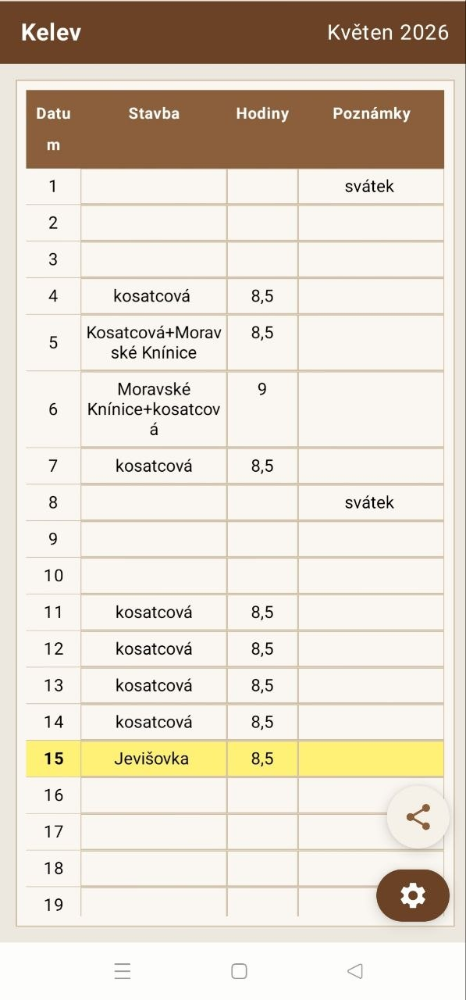
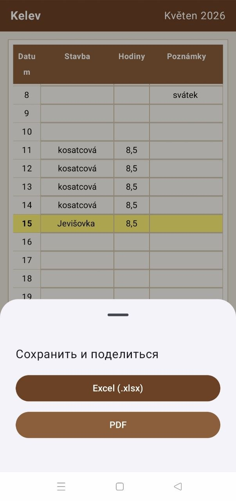
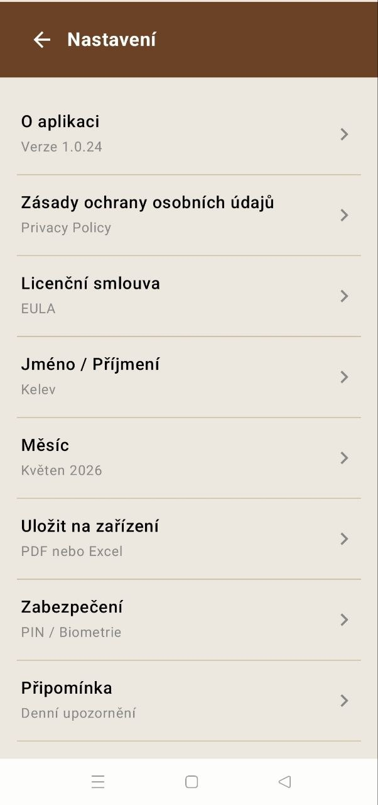
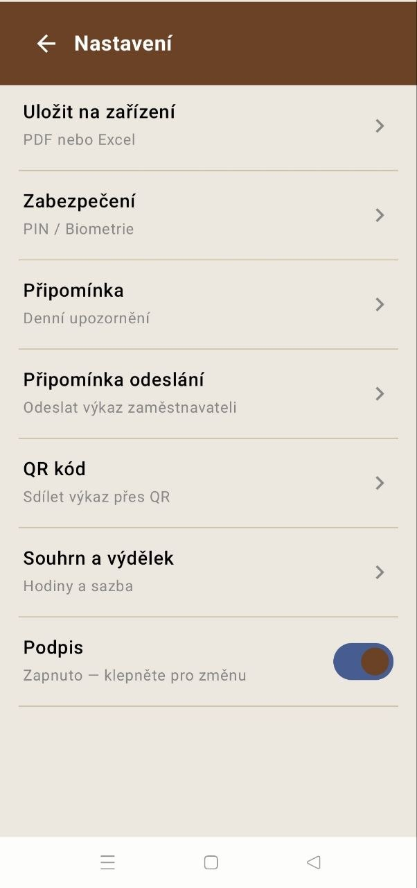
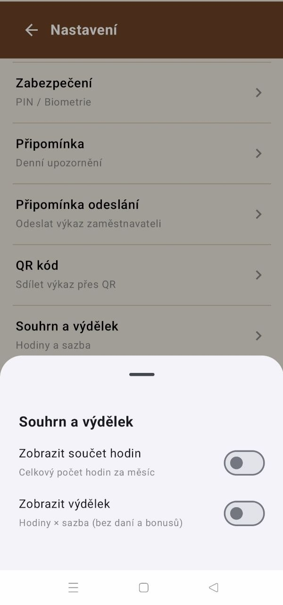
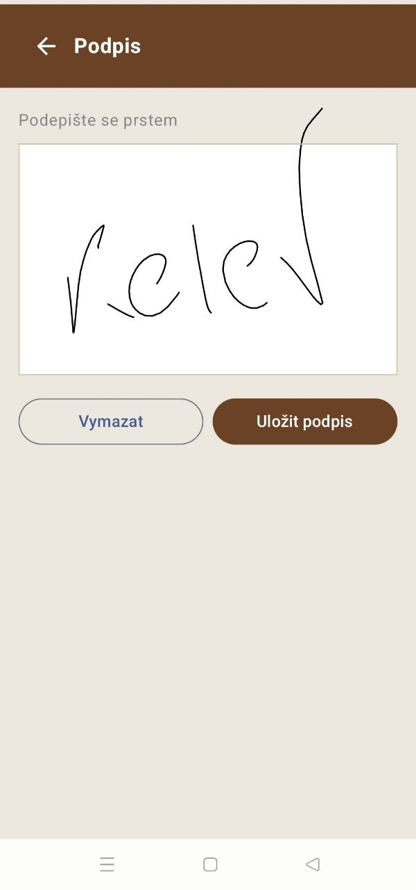
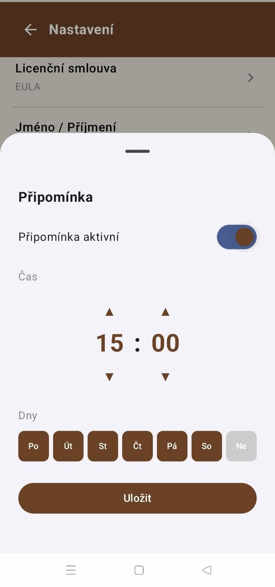
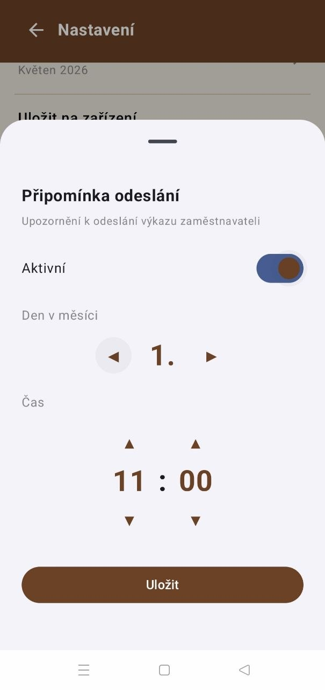

# Šichta — Work Hours Tracker for Android

Šichta is a simple and intuitive Android app for tracking daily work hours, calculating earnings, and exporting timesheets.

## Features
- Daily work hours table with autosave
- PDF and Excel export
- Handwritten signature in PDF
- QR code for quick timesheet sharing
- Automatic earnings calculation based on hourly rate
- Daily reminder to fill in hours
- Monthly reminder to send timesheet to employer
- PIN and fingerprint protection
- Works fully offline

## Tech Stack
- Kotlin + Jetpack Compose
- Room Database
- PDF generation with Android Canvas
- Excel export with Apache POI
- ZXing for QR codes
- BiometricPrompt for security

## Screenshots

## Download
*Coming soon on Google Play*

## License
© 2026 Maxim "Kelev". All rights reserved.